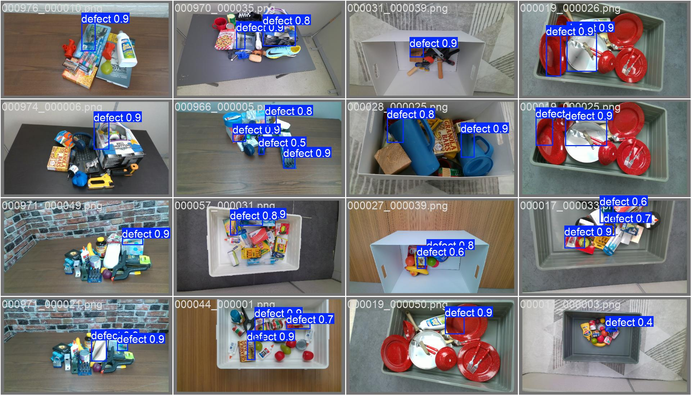
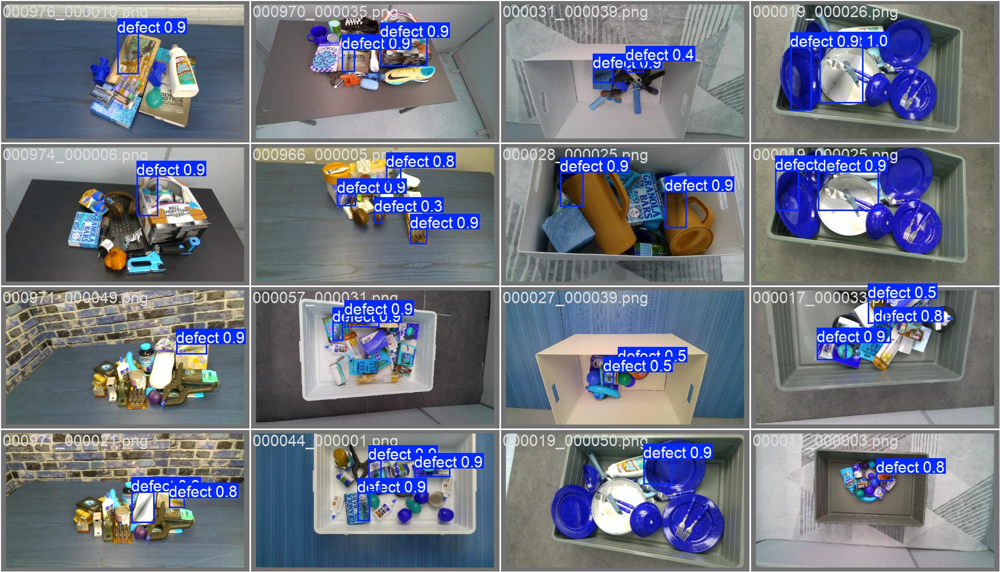
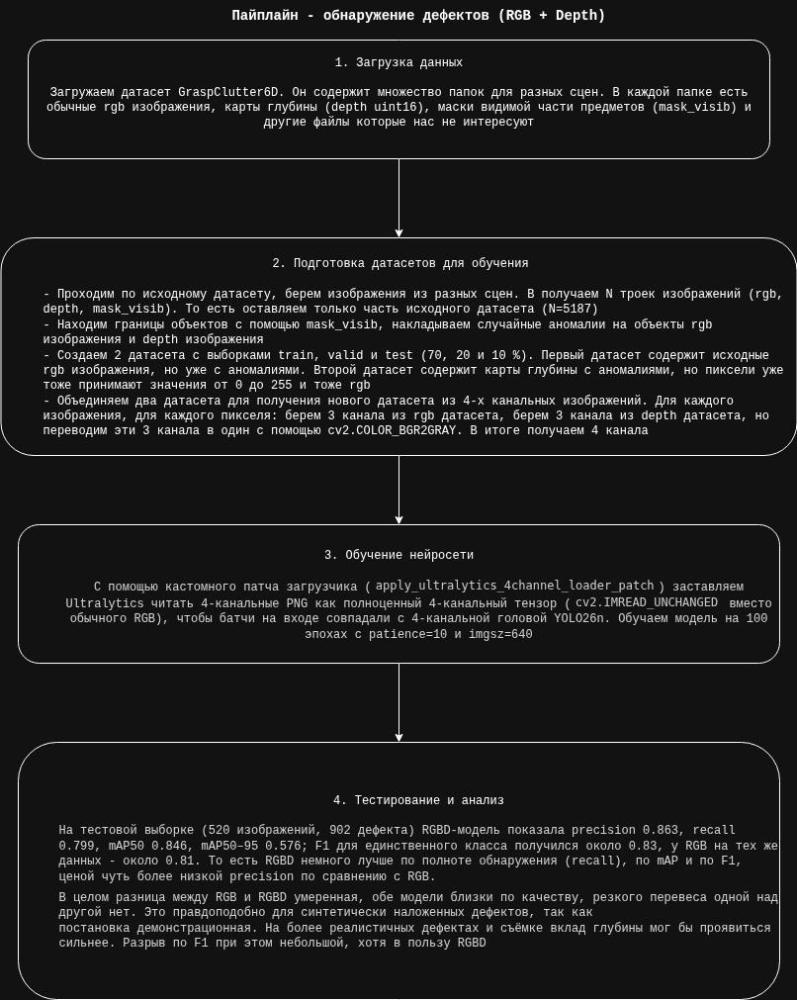

Для выполнения задания был использован датасет GraspClutter6D (содержит RGB и depth), а именно небольшая его часть, т.к. исходный датасет весит > 200 ГБ
Ссылка: https://huggingface.co/datasets/GraspClutter6D/GraspClutter6D

Был реализован алгоритм нахождения границ объектов на основе их масок, а также рисования случайных аномалий на rgb изображениях и depth изображениях (имитация вмятин)

В итоге были получены 2 базовых датасета:
- rgb изображения
- depth изображения, где пиксели нормализованы от 0 до 255

На основе этих датасетов был составлен датасет с 4-х канальными изображениями (rgbd), для обучения на этом датасете был изменен входной слой yolo26n

Для обучения использовался удаленный сервер с GPU (A5000 24 GB)

На тесте (520 изображений, один класс defect, YOLO26n, imgsz 640):
RGB - P 0.865, R 0.769, mAP50 0.841, mAP50-95 0.568, F1 0.814; время обучения ~ 52 минуты;
RGBD (4 канала) — P 0.863, R 0.799, mAP50 0.846, mAP50-95 0.576, F1 0.830; время обучения ~ 1 час.

Вывод: качество сопоставимо, RGB+D слегка выигрывает по recall, mAP50 / mAP50-95 и F1 за счёт небольшого падения precision. Разница умеренная, явного перевеса одной архитектуры нет. Для синтетически наложенных дефектов это ожидаемо, на более реалистичных данных вклад глубины мог бы проявиться сильнее

Краткое описание файлов в utils:
- apply_realistic_dents.py — синтетические дефекты (вмятины) на RGB по mask_visib, 
маска аномалии для разметки
- visualize_objects_from_mask_visib.py — отрисовка контуров объектов по маскам одного 
кадра
- generate_detection_datasets.py — проход по сценам GraspClutter6D, два YOLO-датасета 
(defects_rgb_det, defects_depth_heat_det)
- build_rgbd_4channel_dataset.py — слияние RGB и depth-heatmap в 4-канальные PNG + 
data.yaml с channels=4
- rebalance_detection_splits.py — пересборка выборок 70/20/10 с парой image/label для 
уже готовых датасетов
- train_rgbd_4ch_yolo.py — патч загрузчика Ultralytics под 4 канала и запуск обучения YOLO26n на RGBD
- docker_train_rgbd_y26_gpu.sh — пример обучения RGBD в Docker контейнере на GPU (образ ultralytics)

Запуск:
python -m venv .venv (Python 3.13.5, pip 25.1.1)
pip install -r requirements.txt

Примеры предсказаний на тестовых изображениях:

Схема решения:

